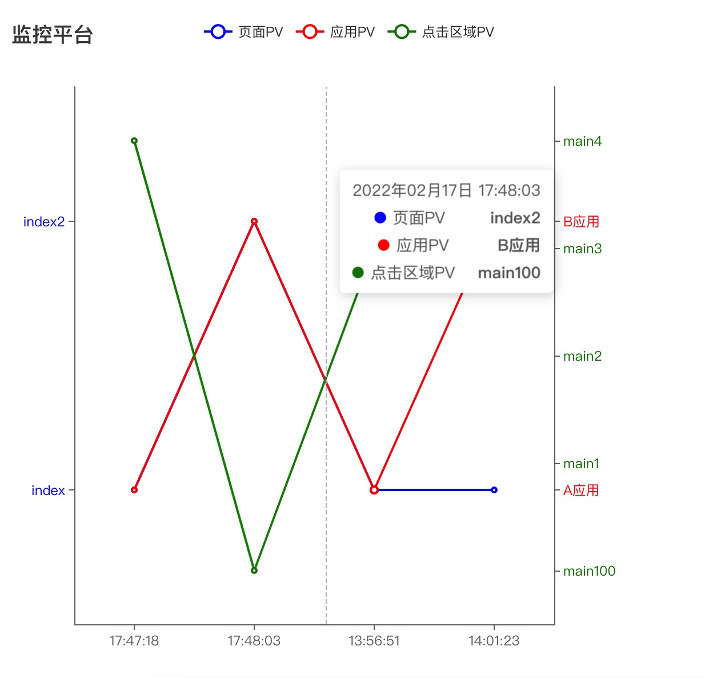

# 监控模块测试代码
## 使用方式
+ git clone 下载项目，进入 node-mlog
+ npm install 安装依赖
+ 替换 router/index 中 hello 接口中访问的 python/scriot.py 的文件地址
+ 替换 python/script.py 中 MaxCompute 中的连接信息
+ node app.js 启动项目
+ 打开 demo 文件在浏览器访问 index.html
+ 点击页面上 a 标签调用接口，上传数据到 MaxCompute
+ visualization 是监控平台的数据可视化显示
